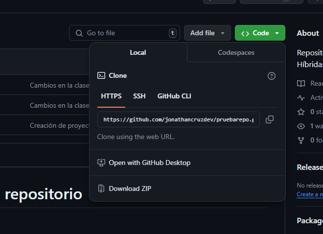

# Pasos para crear un repositorio
1. Inicializo un repositorio
    ``` bash
        git init
    ```
2. Configuro el usuario & email
    ``` bash
        git config user.name "John Do"
        git config user.mail "johndo@mail.com"
    ```
3. Agrego los archivos
    ``` bash
        git add main.js
        git add .
    ```
4. Creo el commit 
    ``` bash
        git commit -m "Proyecto base."
    ```
5. Creo el repositorio en GITHUB
6. Vínculamos el repo local con la nube
    ``` bash
        git remote add origin https://github.com/jonathancruzdev/pruebarepo.git
    ```
6. Realizo el push
    ``` bash
        git push origin master
    ```


1. git add .
2. git commit -m "Descripción"
3. git push orign master


# Pasos para trabar con un repositorio ya creado
1. Abro una carpeta
2. Clono el repositorio
    
    ``` bash
        https://github.com/jonathancruzdev/pruebarepo.git
    ```
3. Configuro el usuario y e-mail
    ``` bash
        git config user.name "John Do"
        git config user.mail "johndo@mail.com"
    ```
4. Realizo git add.... 

# Pasos para trabar con un repositorio en Equipo